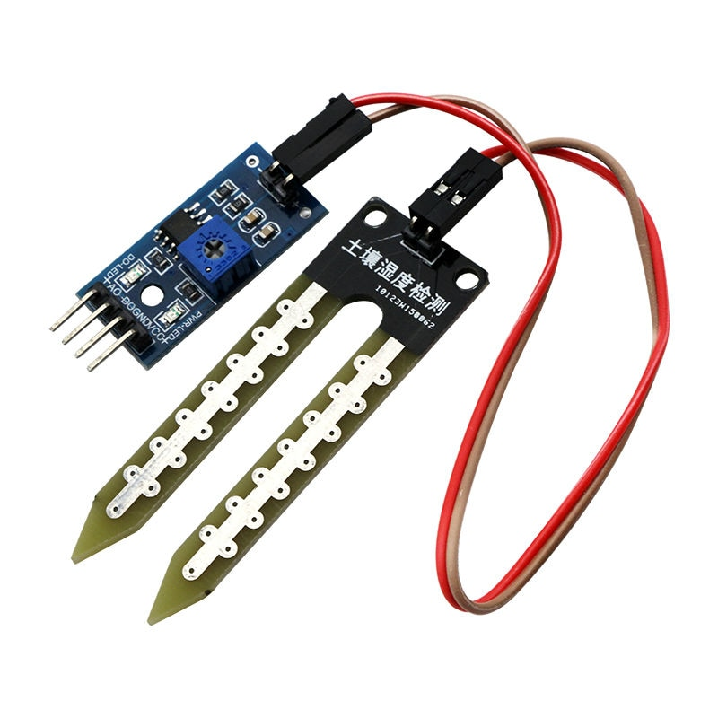
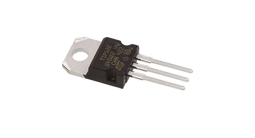

# Regador Autónomo

Proyecto open source de la implementación de un regador autónomo para una huerta casera

## Hardware

**Insumos necesarios:**

| Materiales                                             |                           Imagenes                           |
| ------------------------------------------------------ | :----------------------------------------------------------: |
| Arduino Uno                                            |  |
| Sensor de Humedad                                      |  |
| Bomba de Agua                                          |  |
| Mangera para Bomba                                     |  |
| Transistor (Recomendado: TIP122)                       |  |
| Cable USB y adaptador (output 5V)                      |  |
| Recipiente para Agua                                   |  |
| Resistencia (Suerior a 110 ohms, recomendada 220 ohms) |  |

A tener en cuenta al momento de conseguir los materiales es intentar usar en su mayoría materiales reciclado como una botella de plástico u otro sustituto, un cargador antiguo de 5V con el cable averiado pitillos de goma u otras mangueras reutilizables

**Diagrama de conexiones:**

---

## Software

Para subirle el programa a nuestro sistema deberemos tener instalado es programa Arduino en nuestra computadora, para descargarlo debemos entrar a la pagina oficial y seleccionar el sistema operativo de nuestra computadora.

[Descargar Arduino](https://www.arduino.cc/en/Main/Software)

Posteriormente deberemos abrir el código [regadorAutonomo.ino](regadorAutonomo/regadorAutonomo.ino)  y conectamos nuestro arduino 

Seleccionaremos nuestra placa arduino

Seleccionaremos el puerto donde esta conectada nuestra placa

Compilamos y subimos el código

